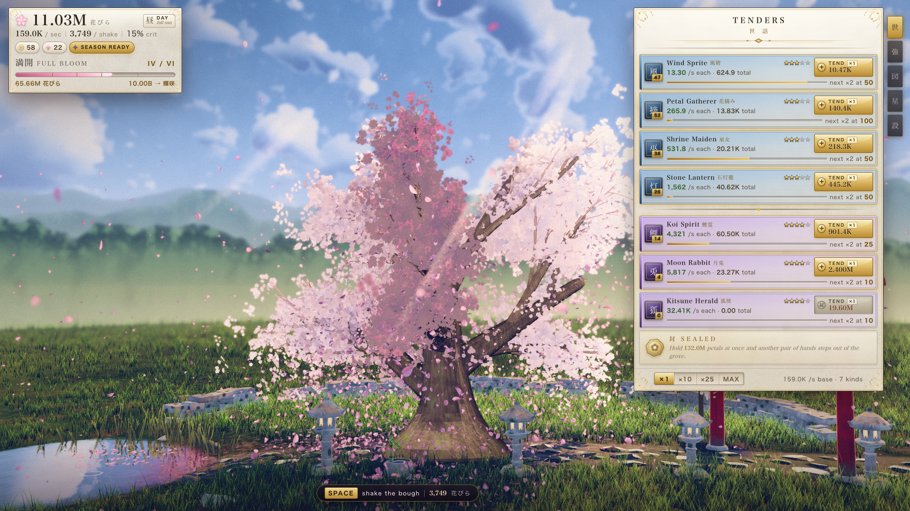

# 桜 Sakura — 영원한 꽃의 꽃잎 (Petals of the Everblossom)

> **한글화 포크** — 원본 [danmana/sakura-idle](https://github.com/danmana/sakura-idle)의 한국어판. 모든 UI 라벨, 안내문, 식물 이름과 일러스트가 한국어로 번역되었습니다.

겨울 눈봉우리 한 개에서 시작해 만개(満開)를 거쳐 **영원한 꽃(常桜, Everblossom)** 까지, 한 그루의 오래된 벚꽃을 키우는 인크리멘털 아이들 게임입니다. 애니메이션 스타일의 NPR/셀셰이딩을 직접 만든 Three.js로 렌더링되며, 클릭으로 가지를 흔들어 꽃잎을 떨어뜨리고, 정령을 고용해 꽃잎을 거둬들이고, 마침내 만개를 향해 나무를 이끕니다.

**▶ 브라우저에서 바로 플레이: [sigco3111.github.io/sakura-idle](https://sigco3111.github.io/sakura-idle/)**

**눈에 보이는 모든 것은 코드로 생성됩니다.** 텍스처, 모델, HDRI, 오디오 파일, 폰트, 런타임 네트워크 요청 — 단 하나도 없습니다. 나무껍질, 꽃 atlas, 잔디, 돌, 물, 구름, UI 필리그리, 음악까지 전부 절차적으로(procedural) 만들어집니다.



---

## 게임 방법

```bash
npm install
npm run dev
```

콘솔에 출력된 URL을 브라우저에서 여세요. 키바인딩은 다음과 같습니다.

- `Space` — 가지 흔들기 (흔들 때마다 꽃잎이 떨어집니다)
- `1`–`9` — 그 순서에 해당하는 정령 구매
- `S` 또는 `,` — 설정 패널 열기
- `[` `]` — 패널 사이를 순환
- `Esc` — 모달 패널 닫기
- `Tab` — 컨트롤 사이를 이동 (접근성)

---

## 무슨 게임인가

### 렌더링 (직접 만든 엔진)

- **커스텀 NPR / 셀셰이딩 라이브러리.** half-Lambert를 밴드형 ramp로 통과시키고, 명확한 종결선(terminator), 색조가 변하는(절대 검정이 아닌) 그림자, 클립된 스펙큘러, 프레넬 림, 감겨진 투과도를 사용해 역광 시 꽃잎이 빛납니다.
- **절차적 벚꽃 나무.** 재귀적 가지 계층, 균열/이끼/지의가 있는 절차적 나무껍질, 5장 꽃잎이 정확히 그려지는 blossom-cluster 카드(인스턴싱), 6단계 개화 단계.
- **하나의 글로벌 바람장.** 잔디, 가지, 꽃잎, 구름, 물이 모두 같은 바람장을 샘플링하므로, 돌풍이 장면 전체를 일관되게 휩쓸고 지나갑니다.
- **GPU 꽃잎 시스템.** 발산 없는 curl-noise advection, 3축 텀블, 가라앉힘과 돌풍 픽업.
- **지형.** 다중 레이어 블렌딩된 지면, 최대 26만 개의 인스턴싱된 풀잎, Poisson 디스크 스캐터.
- **연못.** 평면 반사, 바람에 생기는 잔물결, 표면을 따라 흘러가는 꽃잎.
- **구조물.** 도리이(새문), 야간에 진짜 발광하는 석등롱, 이끼 낀 담장, 츠쿠바이(손水鉢).
- **하늘.** 그려진 볼류메트릭 구름, Mie 전방 산란, 별, 달, 은하수, 레이어된 항공 원근법의 산.
- **포스트 체인.** GTAO → 갓 레이 → 블룸 → CoC 가중 DOF → ACES + 스플릿 톤 그레이드 → 비네트 → SMAA/TAA.
- **완전한 dawn/day/dusk/night 사이클**이 모든 머티리얼을 구동합니다.

### 게임플레이

- **10명의 정령(Tender)**, 이정표 배수, 3가지 업그레이드 계열, 6단계 개화.
- **계절(시즌, 프레스티지)** — 30개 노드의 별자리 트리.
- **실시간 이벤트:** 꽃보라 폭풍(花嵐), 보름달(満月), 황금빛 시간(黄金時), 봄비(春雨), 잡을 수 있는 황금 꽃잎(金花弁).
- **12종 벚꽃 도감**, 약 44개 성취, 오프라인 누적, 버전 관리되는 세이브(자동 마이그레이션 포함).
- **절차적 WebAudio.** 5음 음계의 자동 생성 고토, 실제 바람장에 묶인 환경음, 밤의 귀뚤라미.

**M1 Pro에서 1920×1080 해상도에 ~60fps**, ~61 draw calls, 품질 단계는 `low`까지 지원합니다.

---

## 어떻게 만들었는가

이 프로젝트는 [단일 프롬프트](prompt.md)에서 시작되었으며, Claude Code + Opus 5 가 나머지를 모두 만들었습니다.

다수의 Claude 서브 에이전트를 오케스트레이터 아래에 띄워 만든 것이며, 이를 가능하게 만든 도구들이 그대로 코드베이스에 보존되어 있습니다.

- **`CONTRACT.md`** — 각 에이전트에게 정확히 한 파일의 모듈 책임을 주는 모듈 계약. `import.meta.glob`으로 모듈이 자기 자신을 자동 등록하므로, 한 무리의 에이전트가 병렬로 일해도 머지 충돌이 0건입니다.
- **`ART_BIBLE.md`** — 시각적 진실의 단일 원천. 팔레트, 라이팅 모델, 12축 채점 루브릭, 즉시 실패(instant-fail) 항목들. 아트 리뷰는 adversarial critic 에이전트가 이 문서를 기준으로 강하게 FAIL 쪽으로 편향된 채 점수를 매깁니다.
- **`GAME_DESIGN.md`** — 경제 테이블과 페이싱 타겟이 사양으로 정리된 문서.
- **`tools/shot.mjs`** — 결정론적 스크린샷 하네스. 자체 Vite 서버를 빈 포트에 띄워 N개의 에이전트가 동시에 촬영할 수 있고, 고정 타임스텝 시뮬레이션으로 재현 가능한 프레임을 보장하며, 페이지/셰이더 에러가 하나라도 있으면 non-zero exit을 던집니다.
- **`tools/stats.mjs`** — 객관적인 이미지 게이트(꺼진 검은색, 평탄한 영역, 채도, 미세 디테일, 그림자가 진짜로 색조가 변했는지).
- **`tools/probe.mjs`** — 라이브 씬에 대해 표현식을 평가합니다. 셰이더 소스를 읽는 것보다 디버깅이 훨씬 싸다는 것이 밝혀졌습니다.
- **`tools/sheet.mjs`** — 컨택트 시트와 시드 기반 블라인드 A/B 비교.

`RESUME.md`는 진행 중인 엔지니어링 로그(디버깅 막다른 골목 포함)입니다. *부정적인* 결과를 다음으로 넘기는 것("포스트프로세싱이 아니다, 앰비언트가 아니다, 알베도가 아니다")이 전체 과정에서 가장 레버리지가 큰 한 가지였다는 것을 알았습니다.

---

## 정직한 상태

원래 목표는 "블라인드 비교에서 Genshin Impact와 구별할 수 없는 것"이었습니다. 그 목표는 달성되지 못했습니다. 아티스트가 만든 에셋도 없고 ~6ms 포스트 예산도 없는 브라우저 씬이 그럴 수는 없습니다.

Adversarial critic들(출시된 AAA 기준 + 의도된 FAIL 편향을 가지고 평가)은 이 프로젝트를 10점 만점에 3–4점 대로 평가했으며, 게이트(12개 축 모두 ≥8)는 단 한 번도 통과하지 못했습니다. 알려진 약점은 캐노피 밀도, 왕관의 팔레트 일관성, 중경 대기감입니다.

그렇지만 이것은 **진짜로 인상적이고, 일관된 아트 디렉션을 가진, 완전히 절차적인 실시간 씬**에 완전한 아이들 게임이 따라붙어 있고, 자동화된 시각적 반복을 가능하게 하는 도구 세트가 함께 딸려오는 것입니다.

---

## 라이선스

MIT. 벚꽃 품종 이름과 일본어 텍스트는 일반적인 식물학/통용 용어입니다.

원본 소스 코드와 디자인은 © Opus 5 와 [@danmana](https://x.com/danmana) 의 저작물입니다.
이 한국어판은 MIT 라이선스 조건에 따라 sigco3111 이 번역/배포합니다.

---

## 한/영 표기 안내

이 한글화 포크는 다음과 같은 정책을 따릅니다.

- **일본어 한자(花嵐, 巫女, 風神使, 常桜 등)** — 디자인 자산으로 보고 그대로 보존합니다. 한자를 모르는 독자를 위해 `nameKo` 필드를 항상 함께 제공합니다.
- **식물 품종 영문명(예: "Somei Yoshino")** — 학명 형식이라 영문 그대로 두되, `nameKo`로 한국어 일반명("소메이 요시노")을 함께 제공합니다.
- **게임 라벨, 버튼, 안내문, 메시지, 일러스트** — 100% 한국어로 번역됩니다.
- **식별자** — `id`, `family`, `branch`, `req`, `eff`, `kind`, `role` 등의 객체 키 값은 절대 변경되지 않습니다. 이는 시뮬레이션 로직과 세이브 마이그레이션을 안전하게 보존하기 위함입니다.

## 변경 이력 (한글화 포크)

- **v1.0.0** (2026-08-25) — 초기 한국어판
  - 모든 UI 라벨, 버튼, 안내문 한국어화
  - 벚꽃 12종, 정령 10종, 업그레이드 60+, 별자리 노드 30개, 성취 44개 모두 한국어 번역
  - `vite.config.js`에 `base: '/sakura-idle/'` 추가 (GitHub Pages 서브경로 호스팅)
  - GitHub Pages 배포
  - 원본 모든 기능과 결정론적 시뮬레이션 보존

---

Opus 5 와 [@danmana](https://x.com/danmana), 그리고 한국어판 sigco3111 이(가) ❤️ 를 담아 만들었습니다.
[원본 소스](https://github.com/danmana/sakura-idle/) · [한국어판 소스](https://github.com/sigco3111/sakura-idle/)